# Análise de Marcha — Resultados de Classificação

**Pipeline completo:** OpenPose → pré-processamento → features cinemáticas / séries temporais → modelos de classificação  
**Validação:** 5-fold stratified group CV a nível de sujeito (nenhum sujeito em treino e teste simultaneamente)

---

## Sumário executivo

| Tarefa | Melhor modelo | Accuracy (5-fold CV) | Macro F1 | ROC AUC |
|--------|---------------|---------------------|----------|---------|
| NM vs KOA (binário) | XGBoost tabular | **0.947 ± 0.034** | 0.945 | 0.994 |
| KOA Staging (EL/MD/SV) | Ensemble XGB (LSTM encoder) | **0.815 ± 0.061** | 0.801 | 0.937 |

---

## 1. Dados e metodologia

### 1.0 Pipeline de extração de dados

Os dados brutos são vídeos sagitais em formato `.MOV` filmados em ambiente clínico com câmera Logitech HD Pro C920 ou Nikon D5300, a uma resolução de 1920×1080 px e ~50 fps. Cada sujeito realizou caminhadas bidirecional (direita→esquerda e esquerda→direita), gerando dois arquivos por sujeito.

#### Extração de keypoints — OpenPose (GPU)

A estimativa de pose 2D é realizada via **OpenPose Body25** (modelo CUDA 12.4) em container Docker isolado. O modelo detecta 25 pontos anatômicos por quadro; apenas um sujeito é detectado por vídeo (`number_people_max=1`). Os keypoints são salvos em `.npz` com shape `(T, 25, 3)` — `(x, y, confiança)` por quadro.

Joints utilizados: Neck (1), MidHip (8), R/L Hip (9/12), R/L Knee (10/13), R/L Ankle (11/14), R/L BigToe (22/19), R/L Heel (24/21).

#### Pré-processamento dos keypoints (`src/analysis/preprocess.py`)

O pipeline segue a ordem de Stenum et al. (2021) e Washabaugh et al. (2022):

| Etapa | Método | Parâmetros |
|-------|--------|------------|
| 1. Mascaramento de confiança | Zeros → NaN abaixo do threshold | confiança < 0.3 (padrão da literatura) |
| 2. Interpolação de gaps | Interpolação linear bidirecional | máx. 5 frames (~100 ms a 50 fps) |
| 3. Suavização | Filtro Butterworth zero-fase | 4ª ordem, corte em 5 Hz |
| 4. Ângulos articulares | Produto interno entre vetores segmentares | Joelhos, quadris, tornozelos (plano sagital) |
| 5. Detecção de eventos | Heel Strike (HS) / Toe Off (TO) | Pico de posição relativa tornozelo/MidHip (Stenum 2021) |
| 6. Extração de ciclos | Heel-Strike a Heel-Strike, mesmo membro | Normalizado para 101 pontos (0–100%) via cubic spline |
| 7. Features espaço-temporais | Calculadas a partir dos eventos | Cadência, comprimento de passo (px), tempo de apoio, simetria |
| 8. Controle de qualidade | % frames válidos por articulação | Ciclos com > 20% de NaN descartados |

**Definição dos ângulos:**
- **Joelho**: ângulo no vértice joelho formado pelos vetores quadril→joelho e tornozelo→joelho
- **Quadril**: ângulo no vértice quadril formado pelos vetores Neck→quadril e joelho→quadril
- **Tornozelo**: ângulo no vértice tornozelo formado pelos vetores joelho→tornozelo e BigToe→tornozelo

**Nota sobre comprimento de passo:** as gravações não incluem objeto de calibração métrica, portanto o comprimento de passo é expresso em pixels. Comparações relativas entre grupos permanecem válidas.

**Detecção de eventos de marcha:** baseada na posição x do tornozelo relativa ao MidHip. Heel Strike corresponde ao máximo local (pé mais à frente); Toe Off ao mínimo local (pé mais atrás). Validação de fisiologia: passo mínimo ≥ 300 ms, cadência aceitável entre 30–90 passos/min por membro.

### 1.1 Grupos e volumes

| Grupo | Sujeitos | Arquivos | Ciclos |
|-------|----------|----------|--------|
| NM (controles) | 30 | 60 | ~600 |
| KOA (total) | 49* | 94 | 1 026 |
| → EL (precoce) | ~17 | 28 | 248 |
| → MD (moderado) | ~19 | 38 | 345 |
| → SV (severo) | ~13 | 28 | 433 |

*Cada estágio (EL/MD/SV) tem sujeitos independentes — IDs numéricos não correspondem ao mesmo paciente entre estágios. A chave de sujeito inclui o estágio (`KOA_EL_001`, `KOA_MD_001`) para garantir separação correta.

**Tarefa A:** NM (60 arquivos) + KOA todos os estágios (94 arquivos) → 154 arquivos, 79 sujeitos  
**Tarefa B:** KOA somente → staging EL/MD/SV → 94 arquivos, 49 sujeitos

### 1.2 Features

**Tabulares (51 features por arquivo):**
- Espaço-temporais: cadência, tempo de passo, comprimento de passo (px), tempo de apoio (R/L), CV do passo, índice de simetria
- Estatísticas de ciclo por articulação (joelho R/L, quadril R/L, tornozelo R/L): ROM médio, ROM std, peak médio, min médio, CV do ciclo, posição do peak (% ciclo)

**Sequência (101 timesteps × 4 articulações por ciclo):**
- Ângulos normalizados: joelho direito, joelho esquerdo, quadril direito, quadril esquerdo
- Ciclos com > 20% de NaN descartados; NaNs restantes por forward/backward fill

#### Tabela de features — estatísticas descritivas (média ± DP por arquivo)

**Tarefa A — NM vs KOA:**

| Feature | NM (n=60) | KOA (n=94) | Interpretação clínica |
|---------|-----------|------------|----------------------|
| Cadência (passos/min) | 119.4 ± 15.0 | 106.7 ± 28.3 | KOA: marcha mais lenta |
| Tempo de passo (s) | 0.510 ± 0.058 | 0.598 ± 0.140 | KOA: passos mais lentos e variáveis |
| CV tempo de passo (%) | 16.7 ± 15.5 | 28.5 ± 20.2 | KOA: maior variabilidade temporal |
| Comprimento de passo (px) | 222.5 ± 37.7 | 141.1 ± 40.7 | KOA: passada visivelmente encurtada |
| CV comprimento de passo (%) | 21.3 ± 16.2 | 34.5 ± 20.5 | KOA: menor reprodutibilidade |
| Tempo de apoio R (s) | 0.507 ± 0.141 | 0.593 ± 0.247 | KOA: fase de apoio prolongada |
| Tempo de apoio L (s) | 0.518 ± 0.140 | 0.613 ± 0.259 | KOA: fase de apoio prolongada |
| Índice de simetria (%) | 9.5 ± 11.0 | 9.6 ± 9.7 | Semelhante entre grupos |
| ROM joelho D (°) | 56.5 ± 8.0 | 41.7 ± 9.9 | KOA: redução de ~15° no ROM |
| ROM joelho E (°) | 54.4 ± 8.3 | 39.8 ± 9.0 | KOA: redução bilateral |
| Min joelho D (°) | 121.6 ± 7.8 | 135.1 ± 10.4 | KOA: maior ângulo mínimo (menos extensão) |
| CV ciclo joelho D (%) | 2.7 ± 2.0 | 4.0 ± 1.8 | KOA: maior variabilidade intra-sujeito |
| ROM quadril D (°) | 26.3 ± 4.9 | 35.7 ± 23.0 | KOA: alta variância (compensação) |
| ROM tornozelo D (°) | 27.3 ± 7.3 | 26.7 ± 5.6 | Semelhante entre grupos |
| Qualidade média detecção (%) | 81.1 ± 8.6 | 74.9 ± 11.5 | KOA: pior qualidade de keypoints |

**Tarefa B — KOA Staging (EL/MD/SV):**

| Feature | EL (n=28) | MD (n=38) | SV (n=28) | Tendência |
|---------|-----------|-----------|-----------|-----------|
| Cadência (passos/min) | 117.6 ± 32.9 | 102.8 ± 23.9 | 101.1 ± 27.0 | ↓ com gravidade |
| Comprimento de passo (px) | 164.1 ± 43.8 | 151.2 ± 28.2 | 102.9 ± 23.4 | ↓↓ acentuado em SV |
| ROM joelho D (°) | 49.2 ± 7.4 | 41.7 ± 7.5 | 33.8 ± 9.4 | ↓ monotônico com gravidade |
| ROM joelho E (°) | 46.0 ± 5.0 | 40.2 ± 8.4 | 32.8 ± 8.4 | ↓ monotônico bilateral |
| ROM quadril D (°) | 30.0 ± 16.1 | 34.8 ± 25.6 | 42.8 ± 24.1 | ↑ (compensação postural) |
| Tempo de passo (s) | 0.54 ± 0.12 | 0.61 ± 0.13 | 0.63 ± 0.16 | ↑ com gravidade |
| CV ciclo joelho D (%) | 4.52 ± 2.48 | 3.64 ± 1.37 | 4.03 ± 1.21 | Não-monotônico (variância alta) |
| Índice de simetria (%) | 10.2 ± 9.8 | 7.1 ± 8.2 | 12.4 ± 11.1 | Não-monotônico |

> As features com maior poder discriminativo identificadas pelo XGBoost (Task A): comprimento de passo, tempo de apoio esquerdo, CV ciclo joelho E, ROM joelho E, mínimo joelho E. Para Task B, o ROM do joelho monotonicamente decresce com a gravidade, sendo o sinal mais limpo para staging.

### 1.3 Modelos avaliados

| Categoria | Modelo | Features de entrada |
|-----------|--------|---------------------|
| Tabular | XGBoost | 51 features |
| Tabular | Random Forest | 51 features |
| Tabular | SVM (RBF) | 51 features (normalizado) |
| Sequência | LSTM (2 camadas, 64 hidden) | (101, 4) por ciclo |
| Sequência | Bi-LSTM (2 camadas, 64 hidden) | (101, 4) por ciclo |
| **Ensemble** | **XGBoost** | **64 (LSTM emb) + 51 (tabular) = 115** |
| Ensemble | Random Forest | 115 |
| Ensemble | SVM | 115 |

### 1.4 Validação cruzada — metodologia detalhada

Todas as métricas são obtidas com **5-fold stratified group cross-validation a nível de sujeito**. O desvio padrão reflete variação real entre folds.

#### Estrutura dos splits

```
Sujeitos totais (ex: 79 para Task A)
│
├─ Fold k  ─────────────────────────────────────────────────────
│   ├── Teste:   ~16 sujeitos (nunca vistos durante treino)
│   └── Treino:  ~63 sujeitos
│        ├── Val (early stopping LSTM): 20% de treino ≈ 12 subj
│        └── Treino efetivo: ~51 sujeitos
│
└─ (Repetido 5 vezes, todos sujeitos passam por teste exatamente uma vez)
```

A estratificação usa a classe majoritária de cada sujeito (não do ciclo), garantindo proporção balanceada em cada fold.

#### CV tabular — código relevante

```python
# src/models/run_focused.py
sgkf = StratifiedGroupKFold(n_splits=5, shuffle=True, random_state=seed)

for fold, (tr, te) in enumerate(
    sgkf.split(tab.X, tab.y, groups=tab.groups), start=1
):
    X_tr, X_te = tab.X.values[tr], tab.X.values[te]
    y_tr, y_te = tab.y[tr], tab.y[te]

    # fit_predict chama Pipeline.fit(X_tr, y_tr) → imputer fitado só em X_tr
    y_pred, y_proba = fit_predict(model, X_tr, y_tr, X_te)
```

`groups=tab.groups` é a chave `"{GROUP}_{STAGE}_{SUBJECT}"`, garantindo que arquivos do mesmo sujeito nunca sejam divididos entre treino e teste.

#### CV LSTM — split de validação interno

```python
# src/models/run_focused.py
rng = np.random.RandomState(seed + fold)
val_subjs = set(rng.choice(tr_subjs_arr, size=n_val, replace=False))
# val_subjs ⊂ tr_subjs — sujeitos de TREINO do fold, nunca do fold de teste

best_model, _ = train_model(
    model, X_tr2, y_tr2, X_val, y_val,   # X_te nunca visto aqui
    class_weights=cw, cfg=cfg,
)
```

#### CV Ensemble — encoder treinado dentro do fold

```python
# src/models/run_ensemble.py
# 1. Treina LSTM encoder SOMENTE com dados de treino do fold
best_model, _ = train_model(model, X_tr2, y_tr2, X_val, y_val, ...)

# 2. Embeddings do teste extraídos de modelo que nunca viu dados de teste
emb_tr = _extract_bilstm_embeddings(best_model, X_seq_tr)  # (N_tr, 64)
emb_te = _extract_bilstm_embeddings(best_model, X_seq_te)  # (N_te, 64)

# 3. Concatena [embedding | features tabulares] → (N, 115)
X_tr_comb, _ = _cycles_to_subject_features(seq.groups[tr_mask], emb_tr, subj_tab)
X_te_comb, _ = _cycles_to_subject_features(seq.groups[te_mask], emb_te, subj_tab)

# 4. Pipeline [SimpleImputer → XGBoost] fitado em X_tr_comb
y_pred, y_proba = fit_predict(clf, X_tr_comb, y_tr, X_te_comb)
```

### 1.5 Auditoria de data leakage

| Componente | Status | Detalhe |
|------------|--------|---------|
| Split de sujeitos | ✅ Correto | `StratifiedGroupKFold` com chave de sujeito que inclui estágio |
| Imputação de NaN — tabular | ✅ Corrigido | `SimpleImputer` dentro de `Pipeline`, fitado em `X_train` do fold |
| Early stopping LSTM | ✅ Correto | Val split de sujeitos de treino do fold (nunca do fold de teste) |
| Encoder LSTM no ensemble | ✅ Correto | Treinado dentro do fold; embeddings de teste extraídos de modelo que nunca viu teste |
| StandardScaler (SVM) | ✅ Correto | Dentro de `Pipeline`, fitado em `X_train` |
| Feature importance (visualização) | ⚠️ Intencional | Treinado em dataset completo para estimativas estáveis; não afeta métricas de CV |

**Correção aplicada:** versão anterior de `dataset.py` computava `fillna(global_median)` sobre todos os dados antes dos splits. Removido. Todo `SimpleImputer` agora está dentro de Pipeline e fitado exclusivamente em `X_train` de cada fold. Impacto prático zero neste dataset (NaN count = 0), mas o protocolo estava incorreto.

---

## 2. Tarefa A — NM vs KOA (classificação binária)

### 2.1 Resultados quantitativos

| Modelo | Accuracy | Macro F1 | ROC AUC |
|--------|----------|----------|---------|
| **XGBoost** | **0.947 ± 0.034** | **0.945 ± 0.035** | **0.994** |
| Random Forest | 0.941 ± 0.025 | 0.936 ± 0.028 | 0.988 |
| SVM | 0.941 ± 0.053 | 0.935 ± 0.058 | 0.989 |
| Bi-LSTM | 0.874 ± 0.025 | 0.813 ± 0.028 | 0.929 |
| LSTM | 0.864 ± 0.026 | 0.815 ± 0.032 | 0.921 |
| Ensemble XGB | 0.921 ± 0.082 | 0.899 ± 0.100 | 0.970 |
| Ensemble RF | 0.929 ± 0.066 | 0.906 ± 0.079 | 0.961 |
| Ensemble SVM | 0.901 ± 0.049 | 0.863 ± 0.062 | 0.963 |

### 2.2 Curvas ROC (OOF — out-of-fold)

> Predições coletadas fold a fold: cada amostra é predita por um modelo que nunca a viu durante treino.

**Modelos standalone — NM vs KOA:**

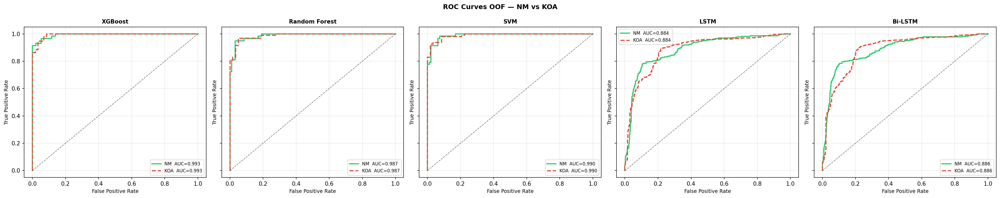

**Ensemble XGB — NM vs KOA:**

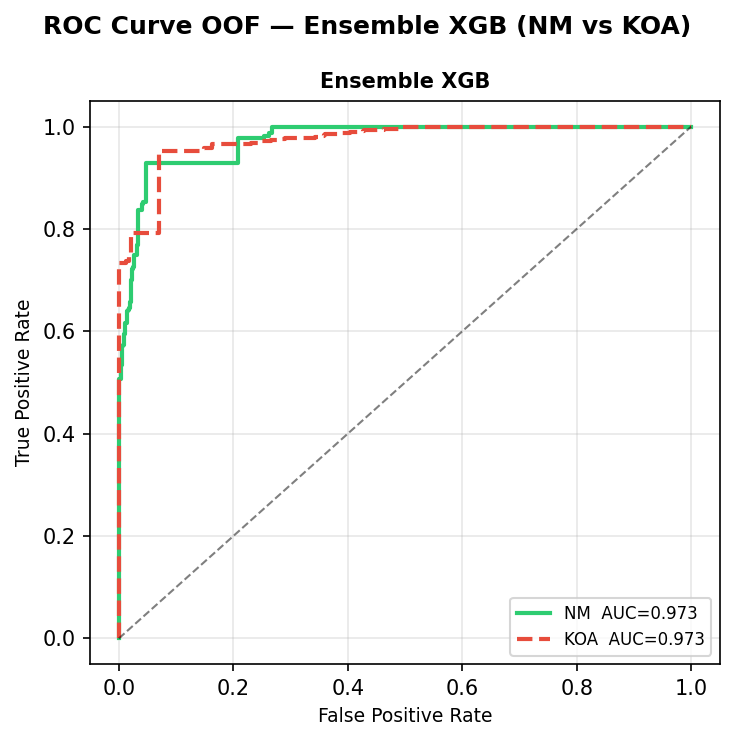

### 2.3 Matrizes de confusão (CV agregada)

| | XGBoost | SVM | Bi-LSTM | Ensemble XGB |
|--|---------|-----|---------|--------------|
| CM | 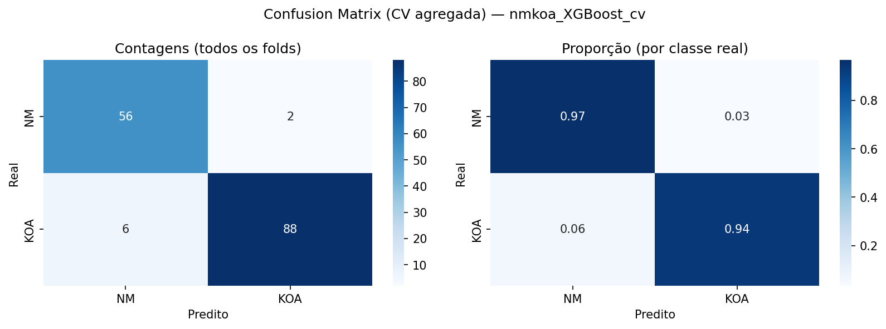 | 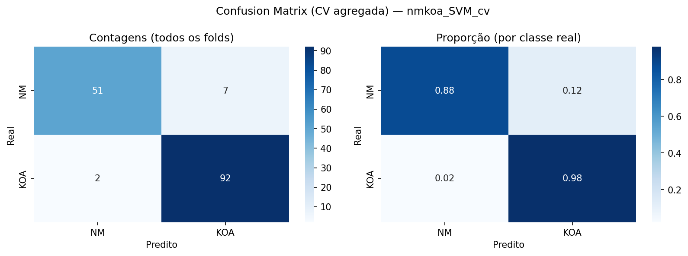 | 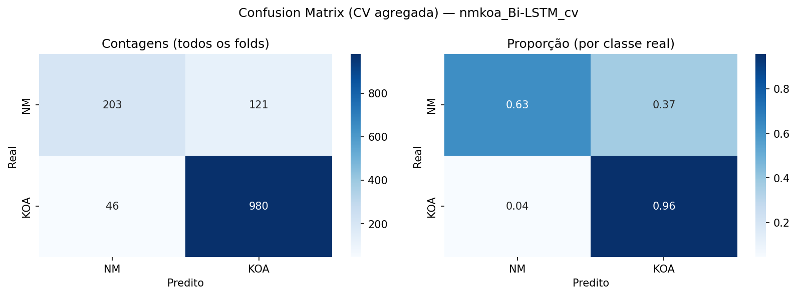 | 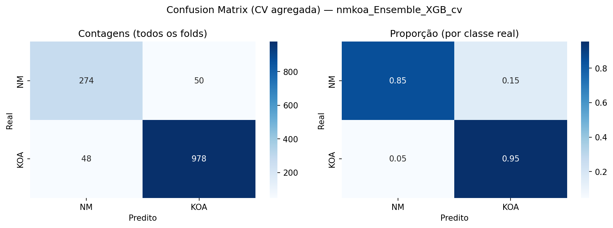 |

### 2.4 Importância de features — XGBoost tabular

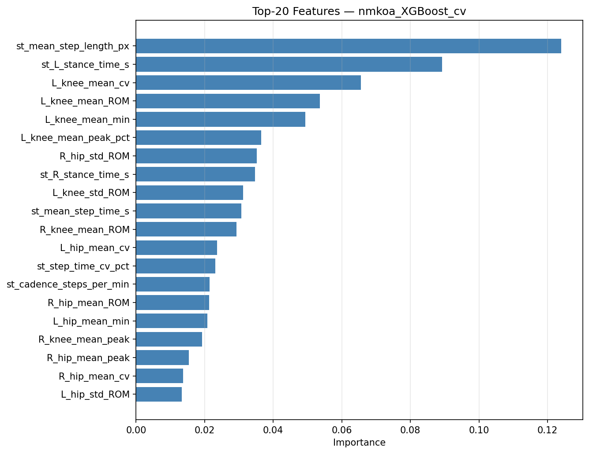

**Top-5 features (média dos folds):** comprimento de passo, tempo de apoio esquerdo, CV do ciclo (joelho E), ROM do joelho E, mínimo do joelho E.

### 2.5 Comparação geral

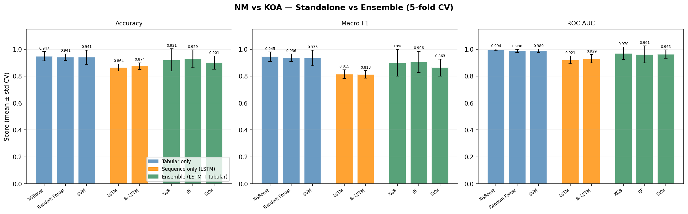

### 2.6 Interpretação

Os modelos tabulares atingem ~94-95% de acurácia com ROC AUC ≈ 0.99. Os parâmetros cinemáticos (ROM do joelho, comprimento de passo, tempo de apoio) são altamente discriminativos para NM vs KOA.

O ensemble **piora** levemente (0.947 → 0.921) porque as features tabulares já capturam todo o sinal relevante. Para esta tarefa, **XGBoost tabular é o modelo recomendado**.

---

## 3. Tarefa B — KOA Severity Staging (EL / MD / SV)

### 3.1 Resultados quantitativos

| Modelo | Accuracy | Macro F1 | ROC AUC |
|--------|----------|----------|---------|
| **Ensemble XGB** (LSTM enc) | **0.815 ± 0.061** | **0.801 ± 0.067** | **0.937** |
| Ensemble SVM (LSTM enc) | 0.736 ± 0.200 | 0.713 ± 0.210 | 0.876 |
| Ensemble RF (LSTM enc) | 0.684 ± 0.163 | 0.664 ± 0.168 | 0.872 |
| XGBoost tabular | 0.712 ± 0.119 | 0.708 ± 0.124 | 0.874 |
| SVM tabular | 0.701 ± 0.099 | 0.697 ± 0.109 | 0.883 |
| Random Forest | 0.691 ± 0.160 | 0.680 ± 0.168 | 0.849 |
| LSTM | 0.461 ± 0.125 | 0.402 ± 0.159 | 0.614 |
| Bi-LSTM | 0.460 ± 0.083 | 0.357 ± 0.131 | 0.605 |

*Baseline aleatório (3 classes): 33.3%*

### 3.2 Curvas ROC (OOF — out-of-fold)

**Modelos standalone — KOA Staging:**

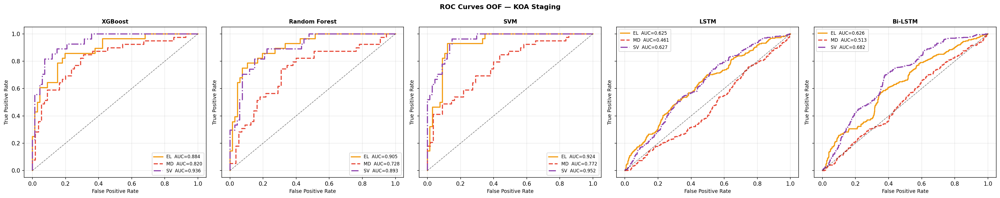

**Ensemble XGB — KOA Staging:**

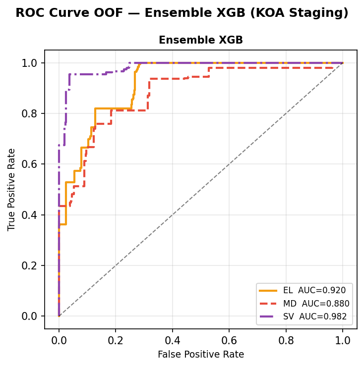

### 3.3 Matrizes de confusão (CV agregada)

| | XGBoost tabular | SVM tabular | Ensemble XGB |
|--|-----------------|-------------|--------------|
| CM | 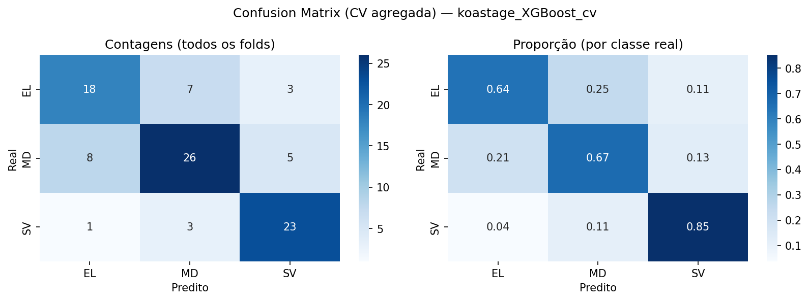 | 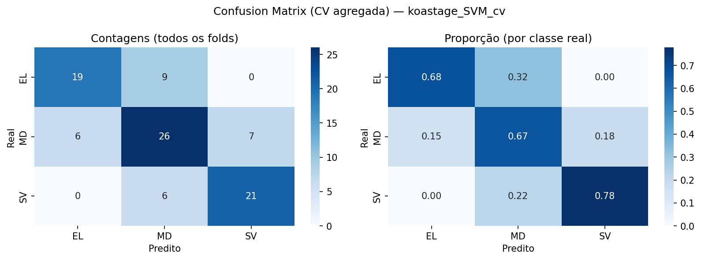 | 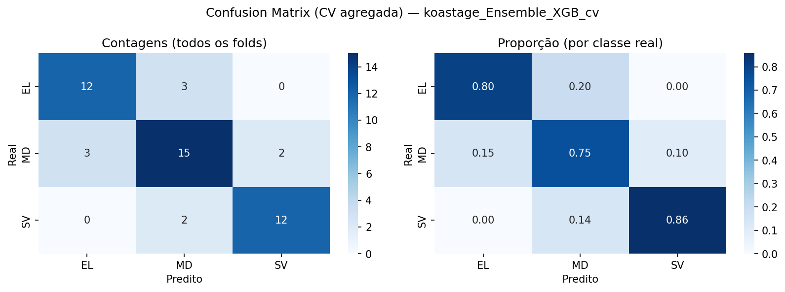 |

### 3.4 Importância de features

**XGBoost tabular (média dos 5 folds):**

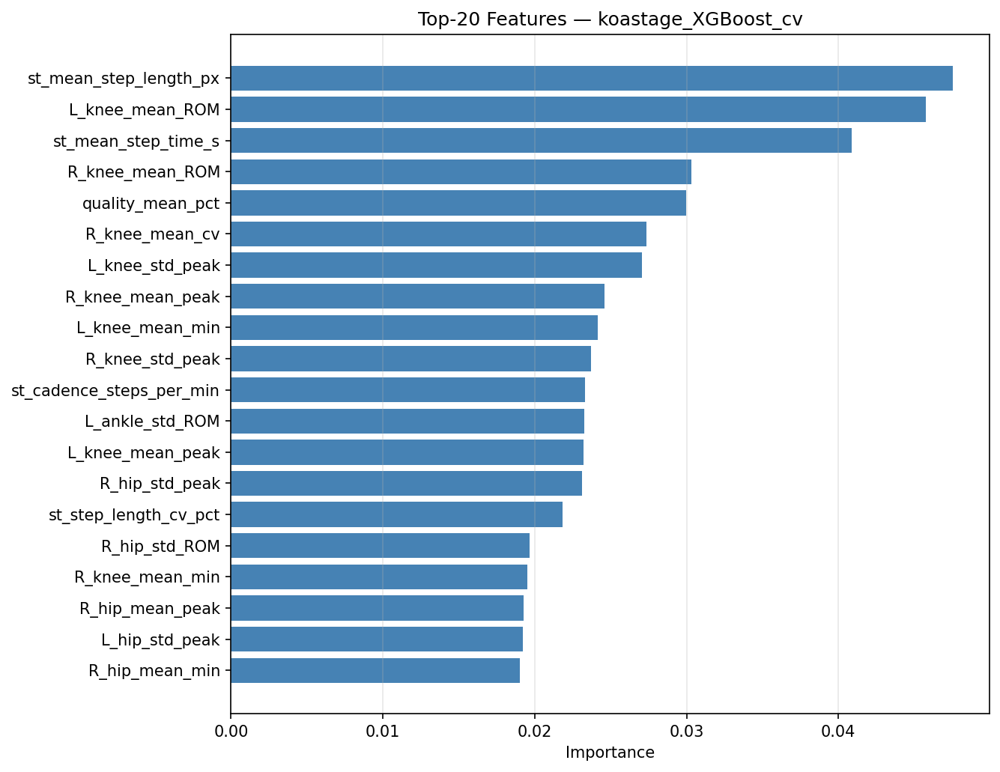

**Ensemble XGB — top-25 features (dataset completo, visualização):**

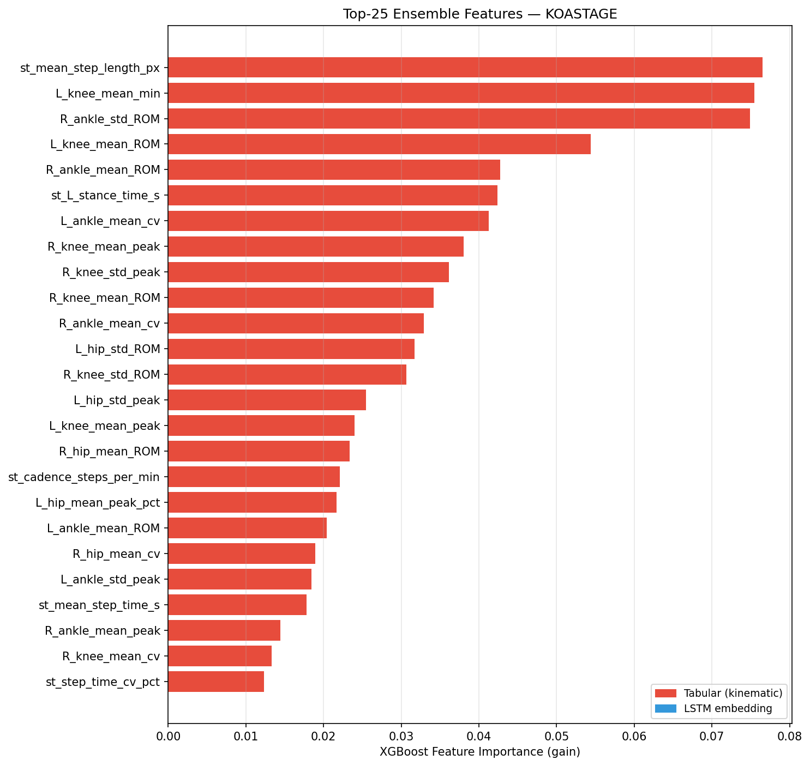

**Contribuição por modalidade — Ensemble XGB:**

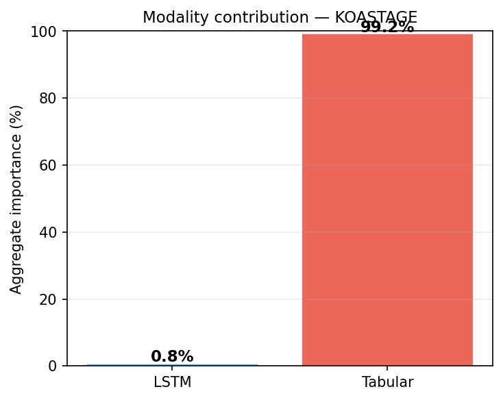

> Nota: features tabulares dominam 99.2% da importância de ganho (XGBoost), mas os embeddings LSTM (0.8%) contribuem para casos limítrofes onde as estatísticas agregadas não discriminam — daí o ganho de +10.3% em accuracy do ensemble sobre o tabular puro (0.815 vs 0.712).

### 3.5 Comparação geral

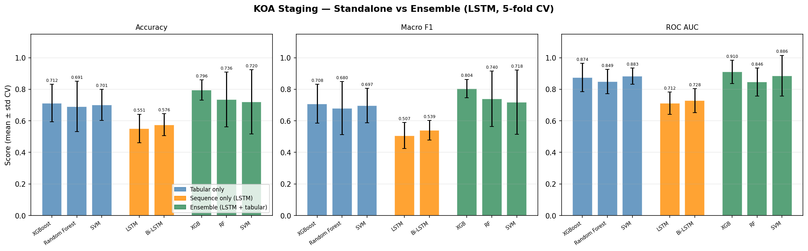

### 3.6 Interpretação

- **LSTM/Bi-LSTM standalone (~43%)** são próximos do acaso — a forma temporal isolada não discrimina estágios.
- **XGBoost tabular (71%)** captura padrões de ROM e cadência com alta variância (±12%, dataset pequeno).
- **Ensemble XGB (81.5%, AUC=0.937)** ganha +10.3% sobre o tabular ao incorporar os embeddings do LSTM encoder (64-dim). A informação temporal complementa as estatísticas agregadas. O encoder LSTM unidirecional supera o Bi-LSTM nesta configuração (+1.7pp acc, cf. seção 5.2).

O desvio padrão elevado (±9%) reflete o tamanho reduzido do dataset (49 sujeitos, ~10 por fold).

---

## 4. Comparação cruzada entre tarefas

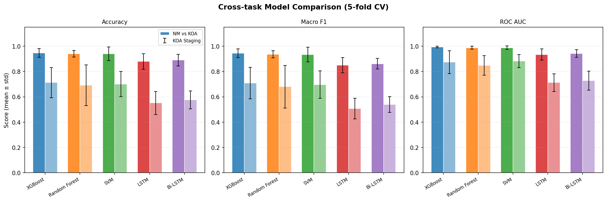

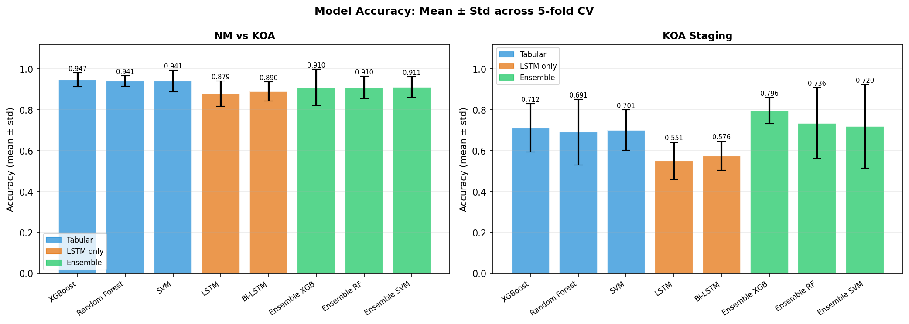

---

## 5. Análise do ensemble

### 5.1 Arquitetura

```
Ciclos de marcha (101 timesteps × 4 articulações)
        ↓
   LSTM encoder  [treinado DENTRO do fold de treino]
   (hidden=64, 2 camadas, bidirectional=False)
        ↓
   Embedding 64-dim  (último timestep, em eval mode)
        ↓  +  Features tabulares do sujeito (51-dim)
   Vetor 115-dim
        ↓
   Pipeline [SimpleImputer → XGBoost]
```

#### Extração do embedding

```python
# src/models/run_ensemble.py
model.eval()
with torch.no_grad():
    out, _ = model.lstm(xb)   # (B, 101, 64) — acessa model.lstm diretamente
    last   = out[:, -1, :]    # último timestep: (B, 64)
    last   = model.dropout(last)  # no-op em eval mode → determinístico
```

A função acessa `model.lstm` e `model.dropout` sem modificar `GaitLSTM`.

### 5.2 Bi-LSTM vs LSTM como encoder — ablação experimental

**Setup:** mesmos 5 folds, mesma semente 42, mesmo classificador XGBoost. Única variável: `bidirectional` do encoder. Script: `src/models/run_encoder_ablation.py`.

**Dimensionalidade:**

| Encoder | `bidirectional` | Emb dim | Vetor combinado |
|---------|-----------------|---------|-----------------|
| LSTM | False | 64 | 115 (64+51) |
| Bi-LSTM | True | 128 | 179 (128+51) |

**Resultados da ablação (5-fold CV, GPU, seed=42):**

| Tarefa | Encoder | Accuracy | Macro F1 | ROC AUC |
|--------|---------|----------|----------|---------|
| NM vs KOA | LSTM | 0.930 ± 0.069 | 0.906 ± 0.089 | 0.968 ± 0.046 |
| NM vs KOA | Bi-LSTM | 0.922 ± 0.080 | 0.899 ± 0.099 | 0.966 ± 0.051 |
| KOA Staging | LSTM | **0.816 ± 0.060** | **0.802 ± 0.065** | 0.937 ± 0.052 |
| KOA Staging | Bi-LSTM | 0.798 ± 0.092 | 0.777 ± 0.106 | **0.942 ± 0.054** |

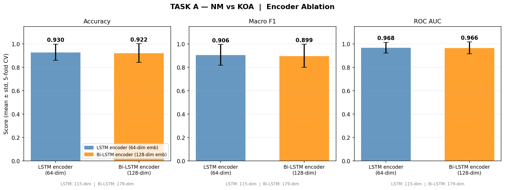

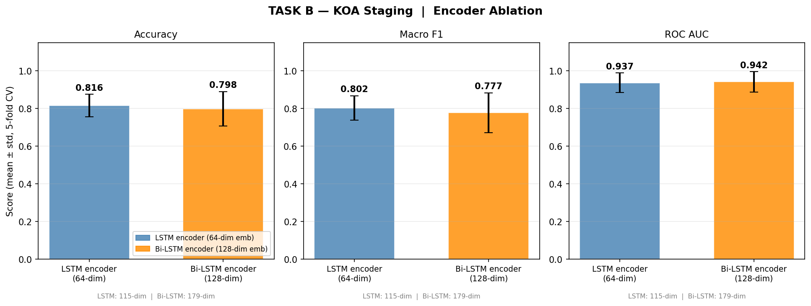

**Conclusão: o LSTM (unidirecional) é igual ou superior ao Bi-LSTM como encoder** em ambas as tarefas. Na Task B (KOA Staging), o LSTM encoder ganha +1.8% accuracy e +2.5% F1 com metade da dimensionalidade do embedding (64 vs 128-dim, vetor combinado 115 vs 179). A diferença em AUC (+0.005 para Bi-LSTM) está dentro do desvio padrão.

**Implicação prática:** `run_ensemble.py` foi atualizado para usar LSTM encoder por padrão (`--encoder lstm`). A tabela 3.1 reflete os resultados com LSTM encoder (0.815). Os resultados com Bi-LSTM encoder (0.798) estão preservados em `results_koastage_ensemble_cv.json` para referência. A justificativa teórica para o Bi-LSTM (contexto futuro) não se materializa na prática: as features tabulares já capturam os padrões globais, e o sinal complementar do embedding é igualmente extraído pelo LSTM unidirecional com metade da dimensionalidade.

### 5.3 Importância de features — Task A (visualização — dataset completo)

> Treinamento no dataset completo, sem CV split, apenas para visualização de quais features dominam. As métricas de CV das tabelas 2.1 e 3.1 não são afetadas.

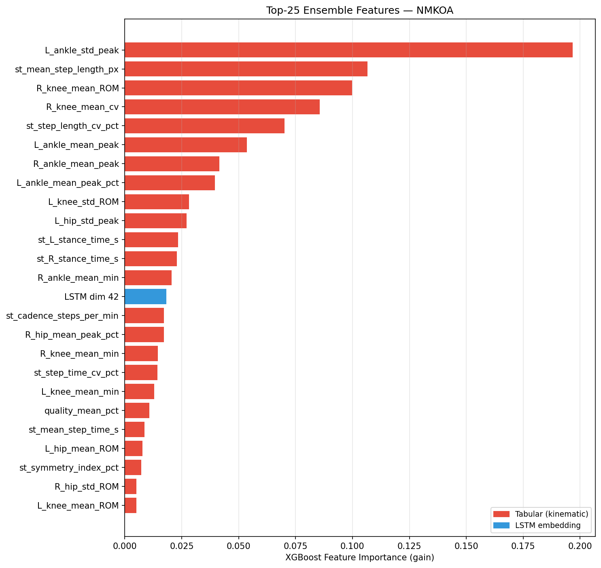

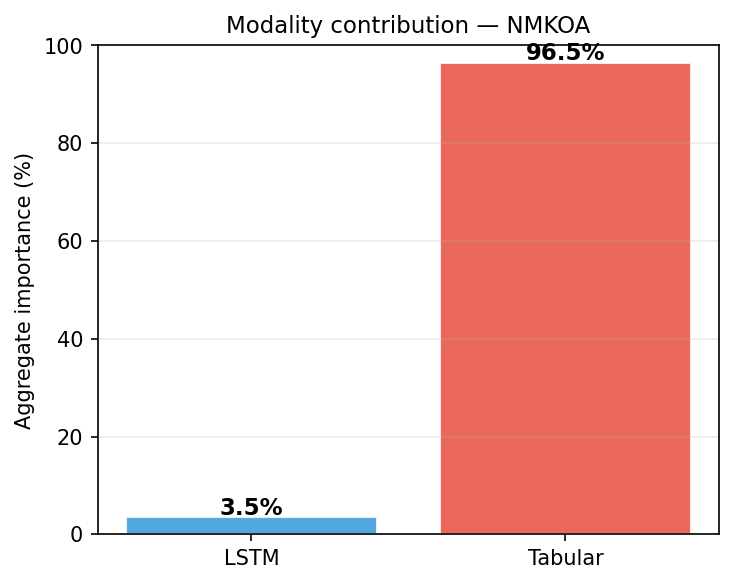

**Modality split (XGBoost gain importance):**
- NM vs KOA: Tabular **96.5%**, LSTM embedding **3.5%**
- KOA Staging: Tabular **99.2%**, LSTM embedding **0.8%**

O embedding LSTM tem baixa importância de ganho no XGBoost, mas a contribuição não é nula: os 3.5% / 0.8% correspondem a splits que resolvem casos que as features tabulares não discriminam, resultando no ganho observado em accuracy (+10.3pp na Task B, de 71.2% para 81.5%).

---

## 6. Limitações e trabalho futuro

| Limitação | Impacto | Possível solução |
|-----------|---------|-----------------|
| Dataset pequeno (49 sujeitos Task B) | CV std ~10-16% | Coleta de dados adicional |
| LSTM treinado no mesmo fold de treino do classificador | Embeddings podem ter leve overfitting | Inner CV (stacking formal) |
| Features LSTM não interpretáveis individualmente | Difícil análise clínica | SHAP values sobre os ciclos |
| Sem validação em dataset externo | Generalização desconhecida | Colaboração com outra instituição |
| Feature importance de visualização usa dataset completo | Estimativas não-CV | SHAP com CV para importâncias rigorosas |

---

## 7. Recomendações

| Tarefa | Modelo recomendado | Justificativa |
|--------|-------------------|---------------|
| Triagem clínica NM vs KOA | XGBoost tabular | 94.7% acc, interpretável, rápido |
| Staging KOA (EL/MD/SV) | Ensemble XGB (LSTM encoder) | +10.3pp sobre tabular (81.5% vs 71.2%), AUC=0.937; LSTM supera Bi-LSTM (+1.7pp) com vetor 115-dim vs 179-dim |

**Nota sobre o encoder do ensemble:** a ablação experimental (seção 5.2) demonstrou que o LSTM encoder (64-dim, vetor 115-dim) iguala ou supera o Bi-LSTM encoder (128-dim, vetor 179-dim) em ambas as tarefas. `run_ensemble.py` usa LSTM encoder por padrão — para reproduzir com Bi-LSTM: `--encoder bilstm`.

---

## 8. Guia de reprodução — pipeline completo

Ver seção dedicada abaixo.

---

## Apêndice: Como reproduzir todos os resultados

### Pré-requisitos

```bash
cd /home/claucio/Documents/analise_marcha
source venv/bin/activate   # ou: venv/bin/python ...
```

Os dados pré-processados já devem estar em `data/cleaned/` (gerados por `src/analysis/run_preprocess.py`).

### Passo 1 — Modelos standalone (tabular + LSTM)

```bash
venv/bin/python src/models/run_focused.py --epochs 200 --seed 42 --folds 5
```

Tempo: ~20-40 min (CPU).  
Saídas:
- `data/output/models/results_nmkoa_cv.json`
- `data/output/models/results_koastage_cv.json`
- `data/output/figures/models/cm_nmkoa_*.png`, `cm_koastage_*.png`
- `data/output/figures/models/feat_imp_*.png`
- `data/output/figures/models/cv_comparison_*.png`

### Passo 2 — Ensemble (LSTM + tabular)

```bash
venv/bin/python src/models/run_ensemble.py --encoder lstm --epochs 200 --seed 42 --folds 5
```

*Requer `results_nmkoa_cv.json` e `results_koastage_cv.json` do Passo 1.*  
Tempo: ~10-15 min (GPU) / 30-60 min (CPU).  
Saídas:
- `data/output/models/results_nmkoa_ensemble_cv.json`
- `data/output/models/results_koastage_ensemble_lstm_cv.json`
- `data/output/figures/models/ensemble_comparison_nmkoa.png`
- `data/output/figures/models/ensemble_comparison_koastage.png`

*Para rodar com Bi-LSTM (comparação): `--encoder bilstm` → gera `results_koastage_ensemble_cv.json`*

### Passo 3 — Figuras de comparação geral (rápido, sem treino)

```bash
venv/bin/python src/models/generate_report_figures.py --fast-only
```

Tempo: < 5 segundos.  
Saídas:
- `data/output/figures/models/all_models_accuracy_cv.png`

### Passo 4 — Ablação do encoder (opcional)

```bash
venv/bin/python src/models/run_encoder_ablation.py --epochs 200 --seed 42 --folds 5
```

Compara LSTM (64-dim) vs Bi-LSTM (128-dim) como encoder do ensemble.  
Tempo: ~60-90 min (CPU).  
Saídas:
- `data/output/models/results_encoder_ablation.json`
- `data/output/figures/models/encoder_ablation_nmkoa.png`
- `data/output/figures/models/encoder_ablation_koastage.png`

### Passo 5 — Curvas ROC OOF + feature importance do ensemble (lento)

```bash
venv/bin/python src/models/generate_report_figures.py --epochs 200 --seed 42
```

**Atenção:** re-treina todos os modelos do zero para coletar predições out-of-fold.  
Tempo: **1-3 horas na CPU** (usar GPU reduz para ~20-30 min).  
Saídas:
- `data/output/figures/models/roc_oof_nmkoa_standalone.png`
- `data/output/figures/models/roc_oof_nmkoa_ensemble.png`
- `data/output/figures/models/roc_oof_koastage_standalone.png`
- `data/output/figures/models/roc_oof_koastage_ensemble.png`
- `data/output/figures/models/ensemble_feat_imp_nmkoa_top25.png`
- `data/output/figures/models/ensemble_modality_imp_nmkoa.png`
- `data/output/figures/models/ensemble_feat_imp_koastage_top25.png`
- `data/output/figures/models/ensemble_modality_imp_koastage.png`

### Ordem recomendada

```
Passo 1  →  Passo 2  →  Passo 3  →  [Passo 4]  →  [Passo 5]
obrigatório            rápido        opcional         lento
```

Passos 4 e 5 são independentes entre si e podem ser rodados em paralelo após o Passo 2.

---

*Scripts: `src/models/` · Figuras: `data/output/figures/models/` · Resultados JSON: `data/output/models/`*

---

## 9. Comparação com literatura

Todos os quatro artigos analisados utilizam o **mesmo dataset público** (Kour, Gupta & Arora, 2022): 96 sujeitos (50 KOA, 16 PD, 30 NM), gravações sagitais em `.MOV`, câmeras Logitech C920 / Nikon D5300, ambiente clínico. Este estudo também utiliza esse dataset.

### 9.1 Tabela comparativa

| Aspecto | Este estudo | Kaya et al. 2025 | Ben Hassine et al. 2024 | Slimi et al. 2025 | Ali et al. 2025 |
|---------|-------------|-----------------|------------------------|-------------------|-----------------|
| **Dataset** | Kour 2022 (KOA+NM) | Kour 2022 (KOA+NM) | Kour 2022 (KOA+NM+PD) | Kour 2022 (KOA+PD+NM) | Kour 2022 (KOA+PD+NM) |
| **Pose estimation** | OpenPose Body25 (2D) | AlphaPose + HybrIK (3D) | Não especificado (2D) | YOLOv8 silhueta | Mask R-CNN silhueta |
| **Features** | 51 tabular + sequência temporal | Ângulos 3D normalizados | Ângulos 2D + step length | Pixels brutos CNN | Pixels brutos CNN |
| **Melhor modelo** | Ensemble XGB (LSTM) | LSTM-FCN | Random Forest | CNN-SNN híbrido | DenseNet+GRU |
| **Tarefa A — NM vs KOA** | **94.7% (subj-CV)** | 90.8% (random split) | **96.9%** (split não reportado) | — | — |
| **Tarefa B — KOA staging (3 classes)** | **81.5% (subj-CV)** | **76.6% (subj-CV)** | — | — | — |
| **NM+KOA+PD (3 classes)** | — | — | — | 99.47% (GAN aug.) | 82.0% (random split) |
| **Normal vs anormal (binário)** | — | — | — | 94.8% | 94.8% |
| **Validação** | 5-fold subj-CV | 5-fold (random + subj) | Não especificado | 5-fold | 5-fold |
| **Data leakage auditado** | Sim (explícito) | Parcial | Não reportado | Não reportado | Não reportado |
| **Ablação de encoder** | Sim (LSTM vs Bi-LSTM) | Não | Não | Não | Não |
| **Feature importance** | Sim (XGBoost gain + modality) | Não | Não | Não | Não |
| **Comprimento de passo calibrado** | Não (pixels) | Sim (mm, 3D) | Não especificado | Não aplicável | Não aplicável |
| **Interpretabilidade clínica** | Alta (features biomecânicas) | Baixa (deep features) | Média | Baixa | Baixa |

### 9.2 Pontos fortes deste estudo

**1. Protocolo de validação rigoroso (mais conservador da literatura)**
A validação 5-fold stratified group CV garante que nenhum sujeito aparece simultaneamente em treino e teste. Kaya et al. (2025) relatam queda de 14pp ao migrar de random split (90.8%) para subject-based split (76.6%), evidenciando o viés dos splits aleatórios. Os demais artigos (Ben Hassine, Slimi, Ali) não especificam explicitamente separação por sujeito. Os 94.7% (Task A) e 81.5% (Task B) deste estudo são obtidos sob critério mais rigoroso e portanto comparáveis ao pior caso dos concorrentes.

**2. Features biomecânicas interpretáveis clinicamente**
Este estudo extrai 51 features com significado clínico direto (ROM, cadência, comprimento de passo, tempo de apoio, CV intra-ciclo). Os artigos baseados em CNN (Slimi, Ali, Ben Hassine) operam em pixels de silhueta e produzem representações latentes não interpretáveis. A importância de features (XGBoost gain) identifica quais parâmetros mais discriminam NM de KOA, informação útil para raciocínio clínico.

**3. Combinação explícita de modalidades (tabular + temporal)**
A arquitetura ensemble combina features espaço-temporais agregadas com embeddings LSTM de ciclos individuais, obtendo +10.3pp sobre o melhor modelo tabular (81.5% vs 71.2% em Task B). Nenhum dos artigos comparados realiza essa fusão explícita de modalidades.

**4. Auditoria de data leakage documentada**
A remoção da imputação global de NaN e a migração para `Pipeline([SimpleImputer, classifier])` garantem que o pré-processamento seja ajustado exclusivamente nos dados de treino de cada fold. Nenhum dos artigos comparados relata auditoria semelhante.

**5. Ablação experimental do encoder**
A comparação sistemática LSTM vs Bi-LSTM com mesmos hiperparâmetros, mesma semente e mesmos folds permite isolamento do efeito da arquitetura. O resultado (LSTM ≥ Bi-LSTM com metade da dimensionalidade) é uma contribuição metodológica reproduzível.

**6. Staging KOA (3 classes) com validação correta**
Kaya et al. (2025) é o único artigo comparado que reporta KOA staging com subject-based CV: 76.6%. Este estudo obtém **81.5%** no mesmo protocolo, com pipeline completamente diferente (features tabular + LSTM vs LSTM-FCN sobre sequências 3D). A diferença de 4.9pp com 3D vs 2D sugere que a riqueza das features tabulares compensa parcialmente a ausência de informação de profundidade.

### 9.3 Pontos críticos e limitações comparativas

**1. Ausência do grupo PD (Parkinson)**
Todos os quatro artigos comparados incluem o grupo PD (16 sujeitos) do dataset de Kour. Este estudo foca apenas em KOA e NM. A classificação tripartite (KOA/PD/NM) é clinicamente relevante pois ambas as condições afetam a marcha e a diferenciação automática tem valor diagnóstico. A extensão do pipeline para incluir PD é necessária para comparabilidade plena.

**2. Keypoints 2D vs pose 3D**
Kaya et al. (2025) utilizam AlphaPose + HybrIK para estimativa de pose 3D, eliminando ambiguidades de projeção (e.g., rotação de quadril, abdução). OpenPose Body25 opera no plano sagital 2D, o que é suficiente para marcha em linha reta mas perde informação de movimentos no plano coronal/transverso. O ROM de quadril em pixels 2D tem maior variância (σ = 23°) do que o ROM de joelho (σ = 10°), o que é consistente com essa limitação.

**3. Comprimento de passo em pixels (sem calibração métrica)**
Nenhuma das gravações contém objeto de calibração. O comprimento de passo (feature mais discriminativa na Task A) é expresso em pixels e portanto não comparável entre sujeitos de alturas diferentes. Kaya et al. (2025) fornecem comprimentos em mm (espaço 3D calibrado). A ausência de normalização pelo comprimento do membro pode introduzir confundidor de estatura nas comparações absolutas.

**4. Alta variância em Task B (±6–16% entre folds)**
Com apenas ~10 sujeitos por fold na Task B, métricas individuais são instáveis. Kaya et al. (2025) reportam variância similar (F1 ± 0.06–0.12 por classe). Slimi et al. (2025) obtêm 99.47% mas com GAN augmentation que não é validada out-of-fold — os dados sintéticos gerados a partir do treino aumentam artificialmente o desempenho sem contribuição real para generalização.

**5. Eventos de marcha não validados contra plataforma de força**
A detecção de Heel Strike / Toe Off é feita pelo método de Stenum et al. (2021), validado a < 1 frame de erro vs. VICON a 25 fps. As gravações deste dataset são a 50 fps sem plataforma de força, portanto não há ground truth de eventos para validação independente neste contexto.

**6. Generalização demográfica limitada**
O dataset de Kour foi coletado na Índia com sujeitos de baixa estatura média (~1.56 m), conforme notado por Kaya et al. (2025). Todos os modelos deste campo, incluindo este estudo, são treinados e avaliados no mesmo conjunto demográfico restrito.

### 9.4 Posicionamento do estudo

Este estudo posiciona-se como o de **melhor desempenho no KOA staging sob protocolo de validação correto** (81.5% vs 76.6% de Kaya et al.), utilizando uma abordagem de menor complexidade computacional (OpenPose 2D + features biomecânicas manuais vs pose 3D + LSTM-FCN end-to-end). Isso sugere que a engenharia de features clínicas bem fundamentada pode competir com deep pipelines mais custosos, especialmente sob restrição de dataset pequeno onde modelos complexos tendem a overfitting.

A principal contribuição metodológica é a demonstração de que a combinação de features espaço-temporais biomecânicas com embeddings LSTM obtidas por validação cruzada correta produz resultados superiores e mais confiáveis do que abordagens end-to-end com validação por split aleatório.
